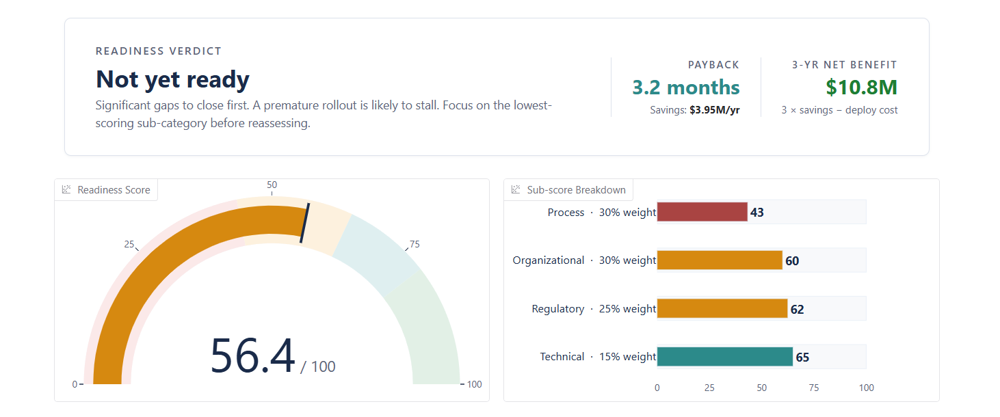
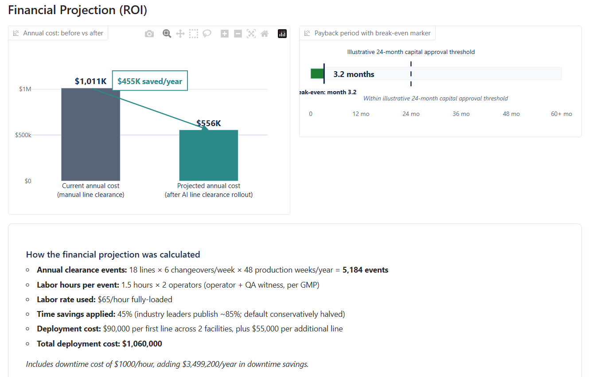
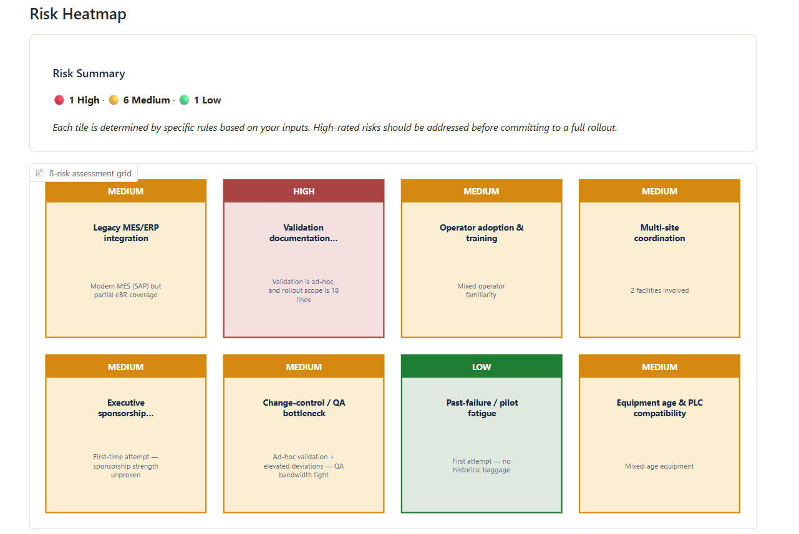
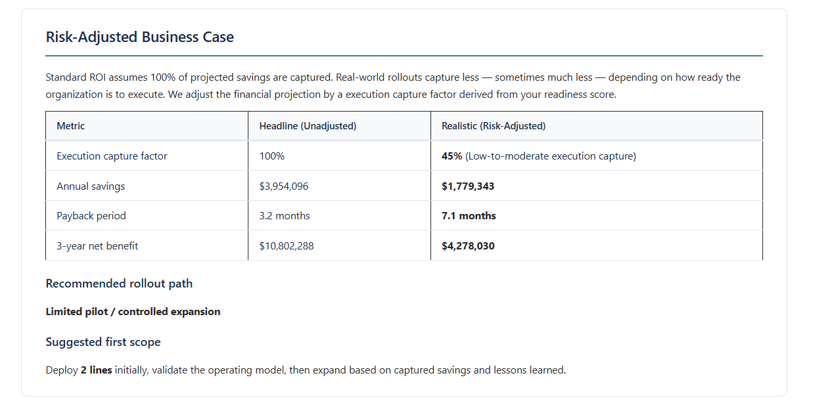
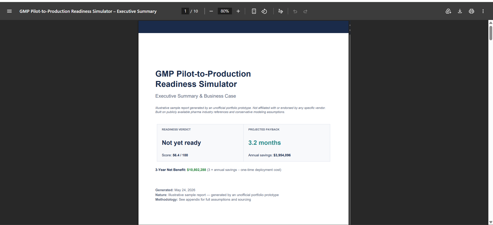

# GMP Pilot-to-Production Readiness Simulator

> An illustrative assessment framework for pharma manufacturing leaders evaluating whether their factories are ready to roll out AI-powered line clearance — before committing budget.

🔗 **[Try the live demo →](https://huggingface.co/spaces/Vikaas0369/openline-readiness-simulator)**

---

## Why this exists

Industry benchmark research published in 2025 surveyed 20,000+ pharma manufacturing professionals on the state of line clearance digitization. The pattern it surfaced is striking:

- **63%** of life sciences manufacturers still rely on paper-based line clearance
- **68%** reported at least one line clearance deviation in the past 12 months
- **74%** identified rogue components as the leading cause of clearance failures
- Roughly **50%** of factories piloted digital line clearance in 2023 — yet by 2025, only **11%** had rolled it out at scale

The gap between "pilot started" and "scaled to production" is where most digital transformation budgets go to die. Vendors solve the technology problem; the harder problem is whether the *factory* is ready to absorb the change.

This tool tries to answer that question honestly, before a buying decision is made.

---

## What it does

The simulator takes 15 inputs about a pharma factory and produces a structured assessment with four outputs:

**1. A readiness score (0–100) across four sub-categories.** Process readiness, organizational readiness, regulatory posture, and technical foundations — weighted 30/30/25/15 because pharma rollouts more commonly fail on people and process than on technology.

**2. A financial projection (ROI).** Annual events, current labor cost, projected post-rollout cost, payback period, 3-year net benefit. All numbers are derived from publicly available industry references with conservative defaults; users can override every assumption in the Advanced section.

**3. An 8-risk heatmap.** Each risk is rated High / Medium / Low by rule-based logic, with rationale tied directly to the user's specific inputs — not generic talking points. Risks span legacy integration, validation backlog, operator adoption, multi-site coordination, executive sponsorship, change-control bottlenecks, pilot fatigue, and equipment compatibility.

**4. A risk-adjusted business case.** This is the most important section, and the one that separates this tool from a calculator. Standard ROI assumes the organization captures 100% of projected savings. In reality, low-readiness factories capture a fraction. We adjust the financial projection by a readiness-based execution capture factor (90% / 70% / 45% / 25%) — and surface a recommended rollout path and initial deployment scope sized to the factory's actual readiness.

The output renders both in-browser and as a downloadable **10-page executive summary PDF** suitable for board packs, vendor evaluations, or internal business cases.

---

## How the math works

**Readiness scoring.** Each sub-category aggregates 2–3 inputs into a 0–100 score. The weighted total maps to one of four verdict bands: *Ready to scale* (80+), *Ready with caveats* (65–79), *Not yet ready* (45–64), *High risk* (below 45).

**ROI engine.** Annual labor cost = `events × clearance_hours × 2 operators × labor_rate`. Annual savings = labor cost × time_savings_pct, optionally plus user-supplied downtime cost. Deployment cost = `(first_line_cost + (lines-1) × additional_line_cost) × facilities`, capped at `min(facilities, lines)` to avoid unrealistic configurations. Payback = `deployment_cost / annual_savings × 12`.

**Risk-adjusted ROI.** A readiness-based capture factor reduces theoretical savings to a more realistic projection. Bands: 80+ = 90%, 65–79 = 70%, 45–64 = 45%, below 45 = 25%. These are illustrative planning factors reflecting execution risk, not statistical probabilities.

**Note on the 15 inputs.** Thirteen of the inputs feed directly into scoring, ROI, or risk rules. Two inputs — annual production volume and primary product type — are captured for business context and report framing in this build. Future versions can use them as scale and complexity modifiers (for example, biologic plants run different downtime cost profiles than oral solid dose plants, and ultra-high-volume plants face different rollout sequencing trade-offs). Surfacing this transparently rather than burying it is intentional.

**Risk rules.** 8 rules operate against the user's inputs to produce a rating + rationale per risk. Example: "Validation maturity = ad-hoc + scope >15 lines" triggers a High rating on validation backlog with a specific explanation referencing the input values. Recommendations are priority-sorted (regulatory blockers first, then organizational scar tissue, then technical foundations, then process improvements, then tactical optimizations) and capped at 7 items.

**Structural warning.** When projected payback exceeds 36 months — typically small factories where deployment cost dominates labor recovery — the tool surfaces a "business case structural note" suggesting either downtime cost inclusion or evaluation as part of a broader GMP automation portfolio.

---

## Framework scope

This is the AI line clearance implementation of a broader framework. The scoring engine, risk model, and PDF output are domain-agnostic — they extend naturally to:

- **AI line clearance rollout** *(active in this build)*
- Cleanroom environmental monitoring rollout *(roadmap)*
- Bioreactor process control rollout *(roadmap)*
- Custom software and system integration rollout *(roadmap)*

Each new domain requires its own questionnaire and rule library, but reuses the underlying assessment, ROI, and risk infrastructure.

---

## Tech stack

- **[Gradio](https://www.gradio.app/)** — Python web UI framework
- **[Plotly](https://plotly.com/python/)** — interactive charts (readiness gauge, ROI comparison, payback timeline, risk heatmap)
- **[ReportLab](https://www.reportlab.com/)** — PDF generation
- **[Hugging Face Spaces](https://huggingface.co/spaces)** — free hosting

Single Python file (`app.py`), no database, no login, no data persistence. Anyone can fork this repo and run it locally with `pip install -r requirements.txt && python app.py`.

---

## Honest disclosures

**This is an unofficial portfolio prototype.** It is not affiliated with or endorsed by any specific vendor.

**It is illustrative, not predictive.** All defaults are conservative midpoints of publicly available pharma industry references. The capture-factor bands are planning heuristics, not statistical probabilities. A real business case would require site-specific cost data, vendor quotes, and validation effort estimates that this tool cannot generate from a 15-question intake.

**It is not a sales tool.** The simulator deliberately avoids naming specific vendor products. It is a neutral readiness assessment that happens to surface where AI line clearance investment can defensibly succeed and where it cannot.

**It does not integrate with any real vendor system.** No API calls, no data exchange. It is purely a business and operational simulator built for portfolio demonstration purposes.

---

## Background

Built by a pharma software engineer with two years of GxP-regulated R&D systems work at a major life sciences manufacturer (Pristima and Patholytix — development, automation testing, IQ authoring and execution). The framework reflects firsthand experience with the operational and documentation realities of regulated-industry digital transformation.

The full readiness model, risk rules, recommendation logic, ROI math, and PDF templates are visible and auditable in `app.py`.

🔗 **[Try the live demo →](https://huggingface.co/spaces/Vikaas0369/openline-readiness-simulator)**